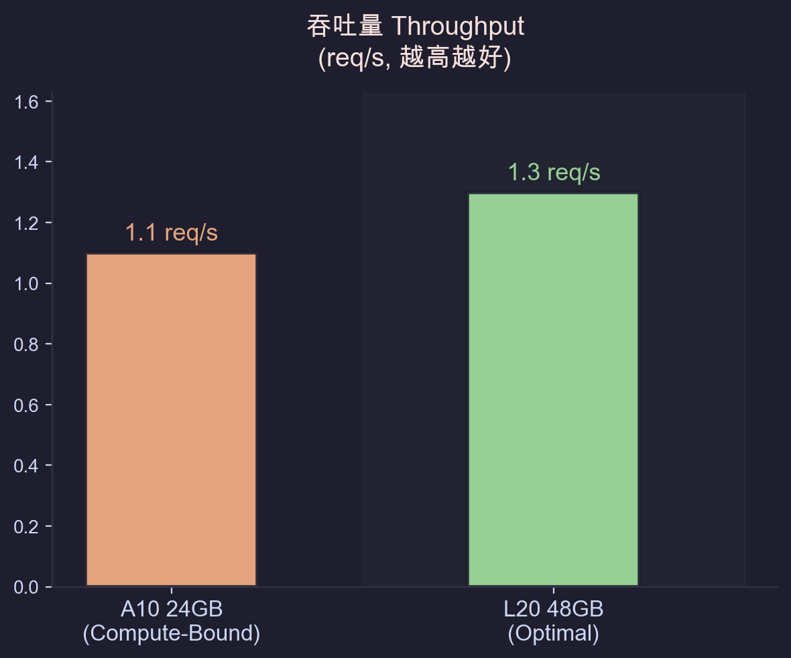
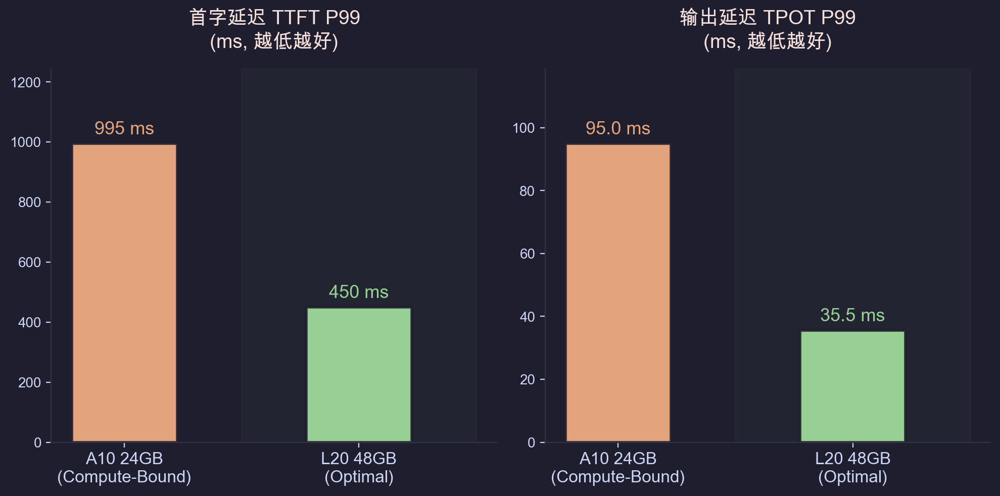
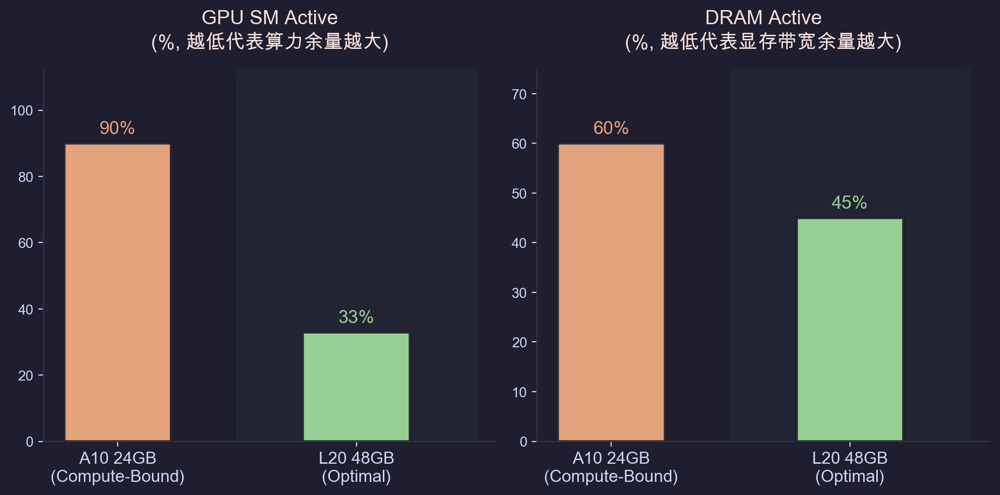

# 医疗理赔与合规文档 AI 推理引擎

> **FoC (Forest of Clauses)** — 一种面向层级结构文档的 LLM 检索范式：让大模型在条款目录树上做语义路由，解决传统向量检索在跨章节关联场景下失效的问题。

覆盖**文档解析 → 多路检索 → 大模型推理 → 理赔决策**全链路的 AI 系统。基于 RAG + GraphRAG + LangGraph Multi-Agent 架构，部署在 Kubernetes 上，支持异构 GPU 算力调度与弹性伸缩。

<p align="center">
  
</p>

## 核心亮点

| 亮点 | 描述 |
|------|------|
| **FoC 条款森林检索** | 将文档层级结构（部分→条→款→项）构建为 ClauseForest 树，由 LLM 在目录树上做条款 ID 路由，再批量拉取原文——传统向量检索搜不到的跨章节关联，FoC 可以 |
| **三路并发检索** | FoC（结构推理）∥ GraphRAG（实体关系遍历）∥ Vector（语义相似度），asyncio.gather 并发执行，检索 P95 < 1s |
| **理赔 Multi-Agent** | LangGraph 双子图并行（ICD-10 编码 + TNM 分期）→ Human-in-the-Loop 审批 → 时间旅行（Checkpoint fork + replay） |
| **数据驱动 GPU 选型** | 三轮压测（A10/L20）：A10 FP8 下 SM Active 100% 被排除，L20 在 c=4 时 SM 仅 33%，TTFT 改善 2x |
| **三级模型路由** | 9B（查询改写，TTFT < 500ms）→ 35B MoE（条款推理，TPOT 24.9ms）→ DeepSeek-Reasoner（理赔决策，0 容错） |
| **Guided Decoding** | vLLM FSM 约束 token 采样，高并发下 JSON 输出合规率从 ~85% 提升至 100% |

## 目录

- [医疗理赔与合规文档 AI 推理引擎](#医疗理赔与合规文档-ai-推理引擎)
  - [核心亮点](#核心亮点)
  - [目录](#目录)
  - [架构概览](#架构概览)
  - [模型路由](#模型路由)
  - [质量评估](#质量评估)
  - [部署指南](#部署指南)
    - [外部服务依赖](#外部服务依赖)
    - [本地开发](#本地开发)
    - [K8s 部署](#k8s-部署)
  - [项目结构](#项目结构)
  - [CI/CD](#cicd)
  - [技术栈](#技术栈)
  - [压测报告](#压测报告)
      - [Qwen3.5-9B 硬件选型对比 (A10 vs L20)](#qwen35-9b-硬件选型对比-a10-vs-l20)
  - [License](#license)

---

## 架构概览

**系统架构**：K8s (ACK) 部署，Ingress 统一入口，三级模型路由层 (9B → 35B MoE → DeepSeek-Reasoner)，基于 vLLM 原生指标 (`num_requests_waiting`) 的 HPA 弹性伸缩，HAMi 实现单卡多 Pod 显存隔离。

**存储与检索**：PDF 经 LlamaParse 解析后，自动构建 ClauseForest 并分块向量化，持久化到 PostgreSQL (结构化数据) + Milvus (向量) + Neo4j (图谱)。检索时三路并发：FoC (LLM 在条款树上路由) ∥ GraphRAG (Neo4j 多跳遍历) ∥ Vector (Dense + Sparse RRF)，合并后由 LLM 生成最终决策。

**理赔 Multi-Agent**：LangGraph 编排两个并行子图 (ICD-10 编码 + TNM 分期)，各自在 `interrupt()` 节点挂起等待人工确认。`PostgresSaver` 自动 checkpoint，支持从任意节点 fork 重放 (时间旅行)。完整 API：`/api/claim/submit` → `/api/claim/approve` → `/api/claim/subgraph-replay/{thread_id}`。

**GPU 可观测性**：DCGM Exporter (GPU 硬件) + Prometheus (vLLM 引擎指标) + LangSmith (调用链追踪) + Grafana (统一大盘)。压测发现 9B 在 A10 上 Compute-Bound (SM Active 100%)，切换到 L20 后 SM 降至 33%，TTFT 改善 2x。

> 完整架构图、检索链路、Agent 流程与 GPU 调度细节见 [ARCHITECTURE.md](docs/adr/ARCHITECTURE.md)。

---

## 模型路由

系统按任务复杂度和风险等级将请求路由到不同参数量的模型：

| 任务 | 模型 | 部署 | 选型依据 |
|------|------|------|----------|
| 查询改写 · HyDE · 意图识别 | Qwen3.5-9B | vLLM on A10/L20 | 低延迟高频，few-shot 约束 |
| 保单信息抽取 | Qwen3.5-9B | vLLM on A10/L20 | 规则优先，LLM 仅补缺失字段 |
| 条款检索 · 智能问答 | Qwen3.5-35B-A3B (MoE) | vLLM on L20/H20 | 中等推理，MoE 兼顾速度和质量 |
| 理赔 Agent (ICD-10 · TNM) | Qwen3.5-122B-A10B (MoE) | vLLM on H20 × 2 | 医学领域知识，工具调用 |
| GraphRAG · 理赔推理 | DeepSeek-Reasoner | API | 高风险 0 容错，CoT 推理 |

---

## 质量评估

基于 golden dataset（148 条标注样本）的端到端评估：

| 维度 | 指标 | 工具 |
|------|------|------|
| 检索质量 | MRR · NDCG@K · Hit Rate@K · Precision@K · Recall@K | 自定义 `RetrievalMetrics` |
| 生成质量 | Context Recall · Answer Correctness · Faithfulness | RAGAS 框架 |
| 意图识别 | Intent Accuracy（fact vs logic 分类准确率） | 评估器内置 |

---

## 部署指南

> 本项目是一个完整的生产级 RAG 系统，涉及多个外部服务。部署前请先准备好以下依赖。

### 外部服务依赖

| 服务 | 用途 | 推荐方案 |
|------|------|----------|
| PostgreSQL | 业务数据 · ClauseForest · LangGraph Checkpoint | 本地安装 / 云数据库 |
| Milvus | 向量检索 (Dense + Sparse) | [Zilliz Cloud Serverless](https://zilliz.com/) (免费额度) 或本地 Docker |
| Neo4j | 知识图谱 (GraphRAG · SNOMED-ICD10) | [Neo4j AuraDB Free](https://neo4j.com/cloud/aura-free/) 或本地 Docker |
| Redis | 任务队列 (RQ) · 缓存 | [Redis Cloud Free](https://redis.com/try-free/) 或本地安装 |
| 对象存储 | 原始文档存储 | 阿里云 OSS / MinIO / 本地磁盘 (可配置) |
| GPU + vLLM | LLM 推理 | L20 48GB 推荐；RTX 3090/4090 24GB 可跑 9B；也可纯 API 模式 (DeepSeek) |
| LangSmith | 调用链追踪 (可选) | [免费 tier](https://smith.langchain.com/) |

### 本地开发

<details>
<summary>本地开发步骤（点击展开）</summary>

```bash
# 1. 克隆仓库
git clone https://github.com/EllenLiu2019/rag-fintech.git
cd rag-fintech

# 2. 安装依赖
python -m venv .venv && source .venv/bin/activate
pip install -r requirements.txt

# 3. 配置环境变量
cp ci/.env.example ci/.env
# 编辑 ci/.env 填入数据库密码、API Key 等

# 4. 配置服务连接
# 编辑 conf/service_conf.yaml 填入 Milvus/PostgreSQL/Neo4j/Redis 连接信息
# 编辑 conf/llm_factories.json 配置模型 base_url

# 5. 启动 vLLM 推理服务（另一个终端，需要 GPU）
vllm serve Qwen/Qwen3.5-9B \
  --max-model-len 1536 \
  --max-num-batched-tokens 8192 \
  --enable-chunked-prefill \
  --gpu-memory-utilization 0.90

# 6. 启动 API 服务
python api/rag_server.py

# 7. 启动 Worker（异步文档处理）
python api/worker.py
```

</details>

### K8s 部署

<details>
<summary>K8s 部署步骤（点击展开）</summary>

```bash
# 配置环境变量并部署
cp ci/.env.example ci/.env
# 编辑 ci/.env

# 部署全部组件
set -a && source ci/.env && set +a
envsubst < ci/k8s/configmap.yml | kubectl apply -f -
kubectl apply -f ci/k8s/vllm-9B-deployment.yml
kubectl apply -f ci/k8s/api-deployment.yml
kubectl apply -f ci/k8s/worker-deployment.yml
kubectl apply -f ci/k8s/vllm-hpa.yml
```

详细的 K8s 配置见 [`ci/k8s/`](ci/k8s/) 目录。

</details>

---

## 项目结构

<details>
<summary>目录结构（点击展开）</summary>

```
rag-fintech/
├── api/                          # FastAPI 入口
├── agent/                        # LangGraph Multi-Agent 理赔流程
├── rag/
│   ├── retrieval/                # 检索层
│   ├── generation/               # 生成层 (LLM Service)
│   ├── ingestion/                # 文档解析 & Ingestion Pipeline
│   ├── entity/                   # 数据模型
│   ├── llm/                      # LLM 客户端 (OpenAI/DeepSeek/VLLm + Guided Decoding)
│   ├── embedding/                # Dense (Voyage) + Sparse (BGE-M3) 向量化
│   └── evaluation/               # RAGAS 评估框架 + Golden Dataset
├── graphrag/                     # GraphRAG 索引构建
├── repository/                   # 数据访问层
├── conf/                         # 配置
├── benchmark/                    # 压测 & 评估
├── observation/                  # Grafana 大盘 JSON
├── ci/
├── ui/                           # React 前端
└── docs/adr                      # 技术决策报告
```

</details>

---

## CI/CD

<details>
<summary>CI/CD 流程（点击展开）</summary>

```
git push master
  → GitHub Actions (deploy.yml)
    → Build backend/frontend images
    → Push to Alibaba Cloud ACR
    → envsubst 替换镜像 tag
    → kubectl apply (api · worker · ui · vllm · ingress)
    → kubectl rollout status (等待就绪)
```

vLLM 基础镜像通过 `mirror-vllm.yml` 从 Docker Hub 同步到 ACR（解决国内拉取问题）。

</details>

---

## 技术栈

| 类别 | 技术 |
|------|------|
| 推理引擎 | vLLM · PagedAttention · Guided Decoding (FSM) · CUDA Graphs |
| 模型 | Qwen3.5 系列 (9B / 35B-A3B / 122B-A10B) · DeepSeek-Reasoner |
| RAG | LlamaParse · Milvus (Dense HNSW + BM25 Sparse) · Voyage Embedding · BGE-M3 · Jina Reranker |
| GraphRAG | Neo4j · LLM 实体关系抽取 · SNOMED-ICD10 医学本体 |
| Agent | LangGraph · Human-in-the-Loop · Checkpoint 时间旅行 |
| 评估 | RAGAS (Context Recall · Faithfulness) · 自定义检索指标 (MRR · NDCG@K) |
| 压测 | 自定义并发 Scaling 框架 · GEMM TFLOPS GPU 基准 |
| 微调 | HuggingFace Trainer · BERT Claim Detection (F1 0.91) |
| 后端 | FastAPI · Redis (RQ) · PostgreSQL · SQLAlchemy |
| 前端 | React · Vite · SSE Streaming |
| 基础设施 | Kubernetes (ACK) · HAMi GPU 共享 · HPA · Prometheus · Grafana |
| CI/CD | GitHub Actions · Alibaba Cloud ACR |

---

## 压测报告

基于自定义并发 Scaling 框架，对不同模型和硬件组合进行了多轮压测，确定了最终的部署基线。详细数据见 [`benchmark/TEST_REPORT.md`](benchmark/TEST_REPORT.md)。

| 场景 | 模型 | 硬件配置 | 并发 (c) | 吞吐量 (req/s) | E2E P99 延迟 | 瓶颈分析 |
|------|------|----------|----------|----------------|--------------|----------|
| **查询改写** (短文本) | Qwen3.5-9B | A10 24GB | 4 | ~1.1 | < 1.5s | **Compute-Bound** (SM Active 90%) |
| **查询改写** (短文本) | Qwen3.5-9B | L20 48GB | 4 | ~1.3 | < 1.0s | 算力释放，TTFT 改善 2x |
| **FoC 检索** (长上下文) | Qwen3.5-35B MoE | L20 48GB | 2 | ~0.22 | < 5.0s | **Memory-Bound** (KV Cache 压力) |

#### Qwen3.5-9B 硬件选型对比 (A10 vs L20, 并发 c=4)

**1. 吞吐量对比**

<p align="center">
  
</p>

**2. 延迟指标对比 (TTFT & TPOT)**

<p align="center">
  
</p>

**3. 硬件利用率对比 (Compute-Bound 分析)**

<p align="center">
  
</p>


> **工程决策**：A10 在 8B 下算力触顶，最终选择 L20 作为主力推理卡；针对长上下文场景，通过限制 `max-num-batched-tokens` 避免 OOM，并启用 vLLM 的 Chunked Prefill 优化 TTFT。

技术选型的完整决策过程见 [`docs/adr/TECHNICAL_DECISION_REPORT.md`](docs/adr/TECHNICAL_DECISION_REPORT.md)。

---

## License

MIT

