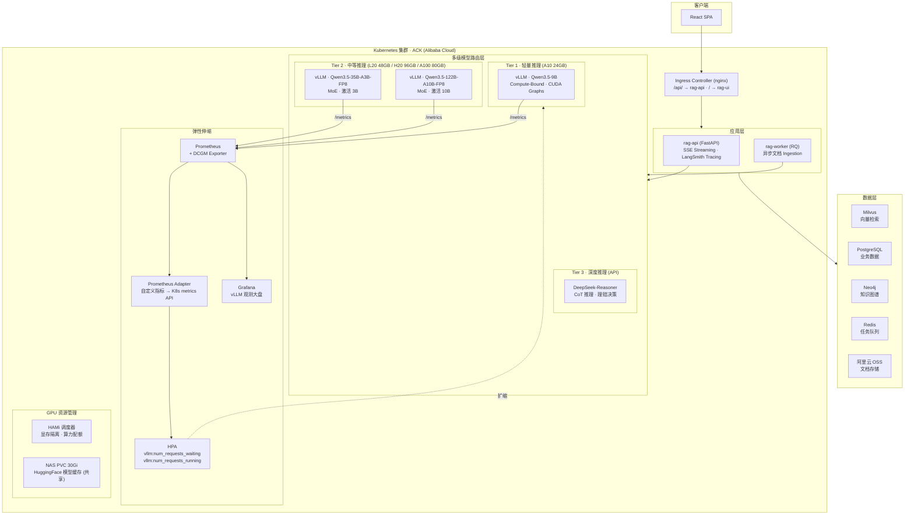
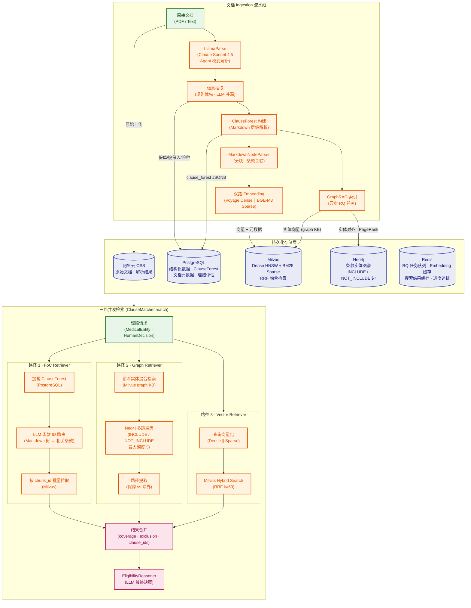
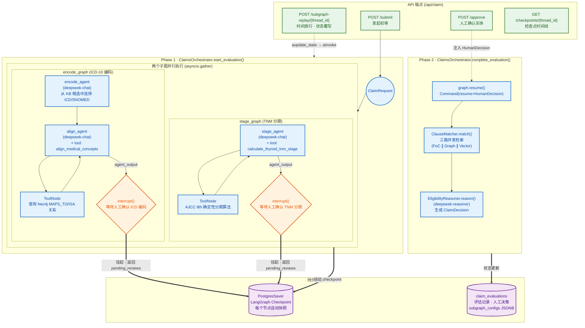

# 系统架构详解

> 本文档包含完整的架构图、检索链路、Agent 流程与 GPU 调度细节。  
> 项目概览请回到 [README](../../README.md)。

---

## 1. 系统架构



### 多平台 GPU 部署

模型按参数量分布在不同算力平台，按需启停控制成本：

| 模型 | GPU | 平台 | 部署方式 |
|------|-----|------|----------|
| Qwen3.5-9B | A10 24GB / L20 48GB | 阿里云 ACK | K8s Deployment + HPA |
| Qwen3.5-35B-A3B-FP8 | H20 96GB × 1 | AutoDL | vLLM 直接启动 (容器实例内无 Docker) |
| Qwen3.5-122B-A10B-FP8 | H20 96GB × 2 | AutoDL | vLLM + `--tensor-parallel-size 2` |

9B 常驻 K8s 集群处理高频请求；35B/122B 在 AutoDL 按需开机（`vllm serve` 直接运行），通过配置 `base_url` 即可接入系统；DeepSeek-Reasoner 直接走 API，无需自部署。

---

## 2. 存储层与检索架构



### 向量检索的局限与 GraphRAG 补位

保险条款中存在大量"双重否定"与"条件豁免"结构（如"除外责任中不包含以下情形"），高维空间相似度无法表征因果逻辑关系。GraphRAG 在此场景的作用：Milvus Hybrid Search 负责在海量文本中快速锚定目标实体（如"甲状腺恶性肿瘤"），返回的 entity_name 作为 Neo4j 的查询入口；Neo4j 沿 `INCLUDE` / `NOT_INCLUDE` 边做多跳遍历（最大深度 5），提取完整的保障-除外责任路径链，最终生成结构化的 coverage / exclusion 证据。

### 三路并发检索

`ClauseMatcher.match()` 通过 `asyncio.gather()` 并发执行三条检索路径：

| 路径 | 数据源 | 检索方式 | 产出 |
|------|--------|----------|------|
| FoC Retriever | PostgreSQL → Milvus | LLM 在 ClauseForest 的 Markdown 树上做条款 ID 路由，再按 chunk_id 批量拉取原文 | 精确条款原文 |
| Graph Retriever | Milvus (graph KB) → Neo4j | 诊断实体混合检索定位图谱锚点，Cypher 多跳遍历提取路径 | 保障/除外责任路径 |
| Vector Retriever | Milvus | Dense + BM25 Sparse 混合检索，RRF (k=60) 融合排序 | 语义相关片段 |

三路结果合并后，由 `EligibilityReasoner` 基于完整证据生成最终理赔决策。

### Ingestion 数据流

```
原始 PDF → OSS (持久存储)
         → LlamaParse (解析为 Markdown + HTML 表格)
         → RuleExtractor (正则 + 表头匹配 + HTML Grid 解析)
         → LLMExtractor (仅补缺失字段，Qwen3.5-9B)
         → ClauseForestBuilder (中文层级标题识别：第X部分 → 第X条 → （X）)
         → MarkdownNodeParser (分块，每个 chunk 关联 clause_id + clause_path)
         → Voyage Dense ∥ BGE-M3 Sparse (并行向量化)
         → Milvus (HNSW + BM25 Sparse Inverted Index)
         → PostgreSQL (结构化实体 + ClauseForest JSONB + 置信度评分)
         → Neo4j (GraphRAG 异步构建，实体对齐 + PageRank)
```

---

## 3. 理赔 Multi-Agent 流程



### Checkpoint 与容错

LangGraph 的 `PostgresSaver` 在每个节点转换时自动将图状态序列化并持久化到 PostgreSQL。当网络中断或模型调用失败时，可从最近的 checkpoint 恢复执行，无需从头开始。

### Human-in-the-Loop 中断

两个并行子图各自在 `approval` 节点调用 `interrupt()`，向外抛出 AI 生成的候选结果（ICD-10 编码 + TNM 分期）。此时 LangGraph 状态被挂起并 checkpoint 到 PostgreSQL。前端展示候选结果供理赔员审核确认后，通过 `POST /api/claim/approve` 注入 `HumanDecision`，状态机恢复执行并进入 Phase 2 的条款检索与推理。

### 时间旅行 (Time Travel)

`POST /api/claim/subgraph-replay/{thread_id}` 可将子图状态回退到任意 checkpoint，注入修正后的变量，通过 `aupdate_state` + `ainvoke(None, forked_config)` 从该节点 fork 出新的执行分支。适用于事后审计中发现实体判断有误的场景——无需整体重跑，只需回溯到出错节点并修正。

### 理赔 API

核心端点：`/api/claim/submit`（发起初审）→ `/api/claim/approve`（人工确认，触发 Phase 2）→ `/api/claim/subgraph-replay/{thread_id}`（时间旅行）。完整 API 定义见 [`api/routers/claim_api.py`](../../api/routers/claim_api.py)。

---

## 4. GPU 算力调度与可观测性

### 异构资源隔离

通过 HAMi 在 L20 上实现单卡多 Pod 共享，按需分配显存和算力：

| Pod | 显存 | 算力 | 用途 |
|-----|------|------|------|
| vLLM (Qwen3.5-9B) | 32 GB / 70% cores | Compute-Bound | 推理服务 |
| rag-api | 3 GB / 15% cores | — | Sparse Embedding (BGE-M3) |
| rag-worker | 3 GB / 15% cores | — | Sparse Embedding (BGE-M3) |

### 弹性伸缩

基于 vLLM 原生指标的 AI-native HPA：

```
vLLM /metrics → Prometheus → Prometheus Adapter → custom.metrics.k8s.io → HPA
```

- **扩容信号**：`vllm:num_requests_waiting > 5`（队列积压）或 `vllm:num_requests_running > 10`（并发饱和）
- **扩容策略**：稳定窗口 30s，每 60s 最多 +1 Pod
- **缩容策略**：稳定窗口 300s，每 120s 最多 -1 Pod（模型加载慢，避免抖动）
- **节点扩容**：HPA 触发新 Pod → Pending → Cluster Autoscaler 自动扩 GPU 节点池

### Compute-Bound vs Memory-Bound

| 场景 | 瓶颈类型 | 特征 | 优化手段 |
|------|----------|------|----------|
| 高并发短文本 (查询改写) | Compute-Bound | TPOT 稳定，TTFT 随队列增长 | CUDA Graphs · enforce-eager |
| 低并发长上下文 (理赔分析) | Memory-Bound | KV Cache 占满显存，TPOT 上升 | PagedAttention · max-model-len 调控 |

### 可观测性

| 层级 | 工具 | 采集指标 |
|------|------|----------|
| GPU 硬件 | DCGM Exporter | 显存利用率 · SM 利用率 · PCIe 带宽 |
| vLLM 引擎 | Prometheus `/metrics` | num_requests_running · num_requests_waiting · TTFT · TPOT · KV Cache 使用率 等 |
| 应用链路 | LangSmith | LLM 调用链 · Token 消耗 · 延迟分布 |
| 大盘 | Grafana | vLLM 性能大盘 · GPU 资源大盘 |
