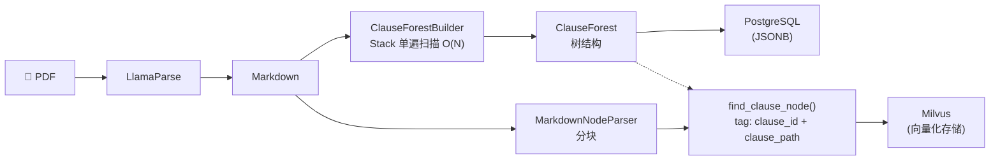
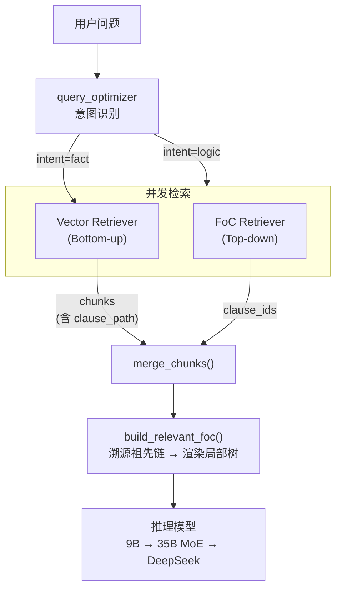

# 架构演进与性能压榨：在金融 RAG 中引入条款森林 (FoC) 

> - **业务痛点**：在金融/医疗等强层级长文档场景中，传统向量检索（含混合检索）面对“跨章节逻辑对比”问题时，存在结构性召回缺失。
> - **架构破局**：设计了 **FoC (Forest of Clauses) 条款森林** 架构，将文档目录树提升为“一等公民”。采用 Top-down（LLM 树结构路由）与 Bottom-up（向量碎片检索）双引擎并发，在内存中完成“局部树”的精准拼装。
> - **工程壁垒**：自研 $O(N)$ 栈式解析器动态构建非标层级条款森林（通用大厂盲区）；引入 vLLM Prefix Caching 解决长上下文的性能瓶颈，实现中、高并发首字延迟（TTFT）从秒级降至毫秒级；结合 Guided Decoding 保证 100% 结构化输出。
> - **最终收益**：在不增加显著推理成本的前提下，彻底解决了复杂逻辑问答的召回盲区，构建了具备垂直领域深度的 RAG 检索引擎。

---

## 1. 痛点

评估一个 RAG 系统的成熟度，不是看它在维基百科上能回答得多好，而是看它在真实的、充满长难句和复杂嵌套的业务文档（如保险条款、法律合同）中是否会“翻车”。

来看一个真实的线上 Case。用户问：
> *“这款产品的的主险和附加险，在保障范围上有什么区别？”*

如果只依赖 Vector Search（哪怕是 Dense + Sparse 的混合检索 + Rerank），结果往往是灾难性的：
* **系统表现**：命中了 3-5 个切片，全部集中在主险的“保险责任”章节。
* **致命缺陷**：**附加险的条款被完全漏掉了！** 因为附加险在 PDF 的第 15 页，从纯语义角度看，它与“主险保障范围”的 Embedding 距离很远。

**架构级根因分析：**
我们真实的感受到向量检索本质上是一种 **Bottom-up（自底向上）的“盲人摸象”**。它把一篇结构严密的文档打碎成了几百个 chunk，**丢掉了文档的全局目录、章节嵌套、排除与附加关系**。当回答需要跨章节逻辑关联的问题时，碎片化的 chunk 根本无法拼凑出完整的全貌。通用商业化方案在这里存在结构性的天花板。

---

## 2. 引入双引擎架构与“上帝视角”

既然向量检索会丢失文档结构，那为什么不直接让大模型先看一眼“目录”呢？

这就是 **FoC (Forest of Clauses)** 的核心思想：**不在语义空间里盲搜，而是让大模型像人翻书一样，在文档的层级结构（目录树）上做全局路由。**

在检索层设计了**松耦合的双路并发架构 (`asyncio.gather`)**：
1. **Vector 检索（Bottom-up）**：负责细粒度实体匹配（如找“甲状腺癌”、“质子重离子”的具体定义）。
2. **FoC 检索（Top-down）**：负责跨章节逻辑关联。把整篇文档的“树干”（章节标题）喂给 LLM，让 LLM 勾选出需要阅读的章节 ID。

这两路检索互不干扰，最终在内存中完成 Merge。

### 2.1 整体架构

#### Ingestion 阶段（离线）

#### 检索阶段（在线）

为极致压缩推理成本，在最前端前置了 9B 模型的意图路由：对于简单的定义查询（fact 类），走 Vector 极速召回；只有遇到复杂的条款对比（logic 类），才触发大模型的 FoC 并发检索，实现算力的合理分配。

---

## 3. 核心工程实现：做“难而正确”的事

要让这套机制在生产环境中稳定、高效地跑起来，在工程上做了四个关键动作：

### 3.1 构筑领域壁垒：Stack 单遍扫描与非标解析

保险条款的原始输入是线性的 Markdown 文本流。需要从中还原出一棵树。通用大厂的解析器（如 LlamaParse）只能识别标准的 `#`、`##`。但中国保险业务的标题是极其非标的：“第一部分”、“第一条”、“（一）”。

没有妥协于通用工具，而是手写了正则引擎，并采用 **Stack 单遍扫描（Single-pass Stack-based Parsing）** 算法：
* 维护一个节点栈，遇到同级或更高级标题就 `pop` 回溯。
* 核心逻辑极简：`while current_level <= self.stack[-1].level: self.stack.pop()`
* **工程收益**：时间复杂度严格 $O(N)$，处理 50 页的保单为毫秒级。更重要的是，节点 ID 实现了单调递增分配，为后续检索时 $O(\log N)$ 级别的 `reverse_find_node` 快速查找奠定了数据结构基础。

### 3.2 碎片溯源：给 Chunk 打上“GPS定位”

在 Ingestion 阶段，为每个 chunk 打上了两个关键标签：
* `clause_id`：所属的条款节点 ID。
* `clause_path`：从根节点到该节点的完整祖先链（例如 `"3.10.22"`，代表 主险 -> 责任免除 -> 故意犯罪）。

**架构意义**：有了 `clause_path`，任何一个在向量库里捞出来的孤立碎片，都能瞬间溯源找到它的“完整血脉”（祖先节点链），实现了**从无序碎片到有序结构的反向映射**。

### 3.3 确定性输出：LLM Routing + Guided Decoding

在检索时，将整棵树渲染为极简的 Markdown 目录发给 LLM，让其返回相关 ID 列表。
**工程避坑**：高并发下，即使是 Qwen 35B 的模型，输出 JSON 也容易出现截断或畸形（失败率 ~15%）。
**解决方案**：深度整合 vLLM 的 **Guided Decoding（FSM 约束）**。在 Token 采样阶段强制模型按照预设的 JSON Schema 输出，将结构化解析成功率硬生生提升到了 **100%**，保障了系统的生产级稳定性。

### 3.4 极致上下文优化：拼装“局部盆景”

最后，把 FoC 选中的条款，和 Vector 搜出的碎片汇聚到一起。利用 `clause_path`，从原始的条款树中，把涉及到的节点及其祖先全部提取出来，渲染成一棵**局部树**。

这就像是给最终的推理大模型提供了一盆**定向修剪过的盆景**——既保留了跨章节的层级逻辑（谁是谁的前提，谁是谁的例外），又去除了无关的枝干噪音，极大降低了推理模型的 Context 压力和幻觉概率。

---

## 4. 性能博弈：如何低成本扛住 7K 长上下文？

FoC 架构带来了一个巨大的性能挑战：**长上下文推理成本**。
一份带有主附险保单的条款树干，动辄达到 6K tokens。每次检索都要让 LLM 读完整棵树干，Prefill 阶段的计算量会导致 TTFT（首字延迟）飙升，并发能力极差。

如果不能解决成本和延迟问题，这个架构就是个玩具。

**解法：vLLM Prefix Caching 极致压榨**
分析发现，FoC 的 Prompt 结构简直是为 Prefix Caching 量身定制的：

* **System Prompt（6K+ tokens）**：条款树干，对同一险种**完全固定**。
* **User Prompt（~50 tokens）**：问题，每次不同。

底层推理服务开启 `--enable-prefix-caching`。这 6K+ 的 KV Cache 只在首次请求时计算一次，后续所有针对该保单的并发请求，直接命中显存复用，**将长文本的 Prefill 计算量从 $O(N^2)$ 降维到了接近 $O(1)$**（仅需计算新增的几十个 query tokens）。

**实测数据**（Qwen3.5-35B-A3B 非量化满血版, RTX PRO 6000 96GiB, ~6K input tokens）：

| 场景 | TTFT P99 (Disable) | TTFT P99 (Enable) | 提升幅度 |
|------|-------------------|-------------------|----------|
| Cache 命中单请求 | 227 ms | **111 ms** | **2 倍** |
| c=4 并发 | ~249 ms | ~205 ms | **1.2 倍** |
| c=22 并发 | ~4.9 s | ~747 ms | **7 倍** |
| c=28 并发 | 延迟不可用 | **~996 ms** | **可用性发生质变** |

**核心架构收益**：
1. **免费的并发杠杆**：高并发 (c=22) 下排队延迟从 4.9 秒降至 0.7 秒。在**不增加任何硬件成本**的前提下，将单卡可用并发上限从 c≤16 强行拉升至 **c=32+**，真正达到了商业化落地的苛刻标准。
2. **抹平长文本首字惩罚**：在系统预热后（Cache 命中），单次长文本推理的 TTFT 被压缩至 100ms 级别，彻底消除了用户的“转圈等待焦虑”。

---

## 5. 架构选型：为什么不用 RAPTOR？

在树结构 RAG 领域，Stanford 的 **RAPTOR**（Recursive Abstractive Processing for Tree-Organized Retrieval）是另一条被广泛讨论的技术路线；它的思路恰好与 FoC 对称，但在真实的医疗理赔与金融合规场景中，最终选择了自研 FoC 条款森林：

| 维度 | FoC（本方案） | RAPTOR |
|------|-------------|--------|
| 构建方向 | **Top-down**：利用单遍解析引擎，严格遵循原文物理层级抽取目录树。 | **Bottom-up**：对文本 chunk 进行语义聚类，并依赖 LLM 生成总结性父节点。 |
| 建库成本 (Ingestion) | $O(N)$ 栈式解析，零 LLM 调用，零 I/O，毫秒级生成 | 每层递归调用 LLM 生成摘要，成本高 |
| 可追溯性 | 精确溯源原文位置 | 摘要节点为生成内容，无法直接对应原文 |

RAPTOR 的出现，从学术界侧面印证了“为文档建树（Tree-Organized）”是解决长文本 RAG 召回盲区的绝对正确方向。技术选型必须敬畏业务场景，FoC 吸收了 RAPTOR 的树状检索视野，通过确定性解析，去除了在合规场景下的缺陷，实现了学术前沿与金融级工程落地的融合。

---

## 6. 结语：结构即知识

在 RAG 的世界里，我们往往过于迷信 Embedding 的魔力，而忽略了数据本身的形态。

**FoC (条款森林) 的核心设计哲学在于：结构即知识。**
当文档本身具有严格的层级结构时，这个结构绝不应该只是被丢弃的 Metadata，它本身就是一种极其强烈的检索信号。把“目录结构”提升为一等公民，用 Top-down 的全局视角去弥补 Bottom-up 的局部盲区，同时用极致的工程手段（Prefix Caching, FSM 约束, Stack 解析）去抹平随之而来的性能损耗。

这就是在复杂金融文档问答中，找到的兼顾准确率、性能与成本的破局之道。希望能给各位带来一些架构设计上的启发。
